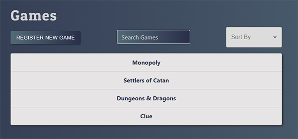
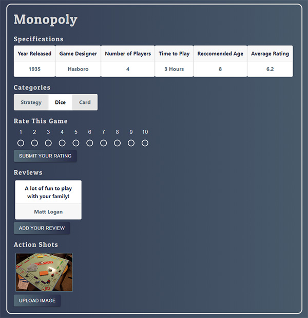
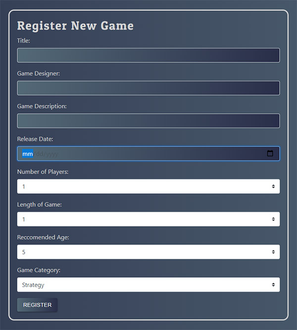

# GamerRater :game_die:

## Full Stack Exercise
### Nashville Software School, Evening Cohort 12
### [Back-End Repo](https://github.com/MLogan1998/gamer-rater)

**GamerRater** is a full-stack app, built with React, Python and the Django REST Framework.

## Features:
* **Authentication**: Register and Log In using Django Token Authentication.
* **Register Games**: Add your favorite games to the database so others can rate, review, and upload their own images.
* **Upload Images**: Users can upload images from their device.
* **Rate and Review**: Users can add a review to to the game, as well as a rating. App displays average of all user ratings.
* **Search Games**: Users can search the game database. Games filtered if query matches title, description, or designer. 
* **Sort Games**: Users can sort the games by year released, designer, or time it takes to play.

## Screenshots:
#### Game List: 

#### Game Details: 

#### Register Game

## Technologies:
* React
* Python
* Django [Back-End Repo](https://github.com/MLogan1998/gamer-rater)
* CSS
* MomentJS
* Material-UI
* reactstrap
